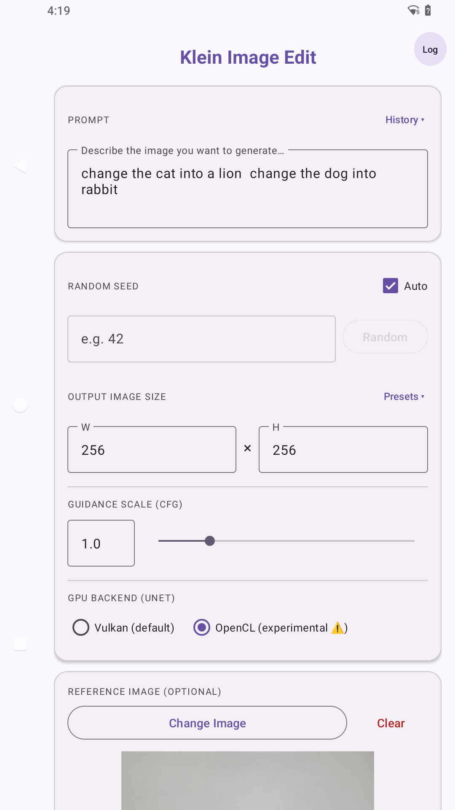
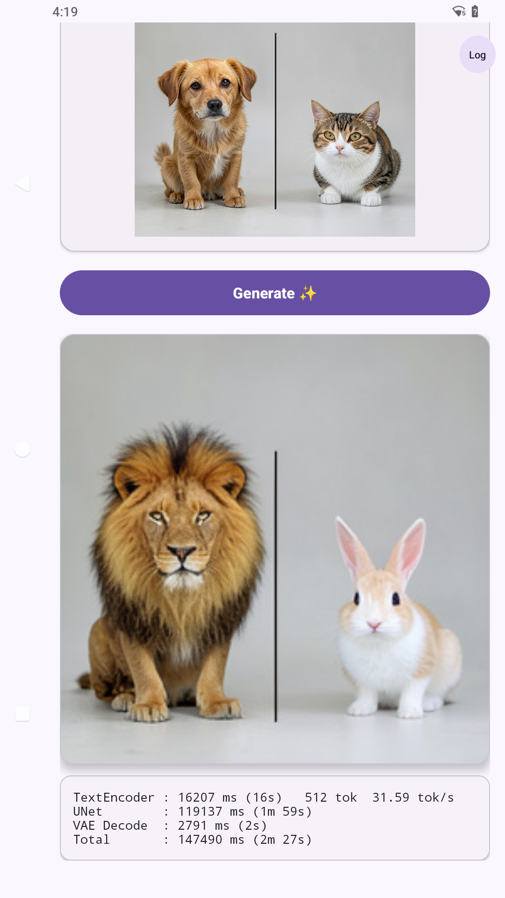
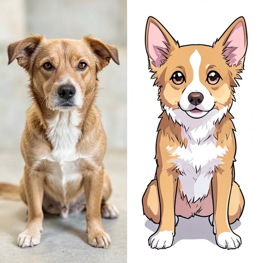

# AndroidFluxKlein

An Android library and demo app for running **FLUX.2-Klein 4B** image generation on-device via [forked MNN](https://github.com/scsonic/MNN).

## Screenshots

<table>
  <tr>
    <td align="center">
      <br/>
    </td>
    <td align="center">
      <br/>
    </td>
  </tr>
</table>

## Generated Image Examples

### Single Image Outputs
Here are some examples of images generated on-device:

| Example 1 | Example 2 | Example 3 |
| :---: | :---: | :---: |
|  |  |  |

### Side-by-Side Comparisons (Image-to-Image / Prompt guided)
These comparisons showcase the input reference image (left) compared to the generated output (right):


## Project Structure

```
AndroidFluxKlein/
├── libFluxKlein/          # Android Library — add one line to use it
│   ├── src/main/cpp/      # JNI bridge (C++) → libdiffusion
│   └── src/main/java/
│       └── com/scsonic/fluxklein/
│           ├── FluxKlein.java          # Main API
│           ├── FluxKleinConfig.java    # Builder-pattern config
│           └── ProgressListener.java  # Progress callback interface
└── app/                   # Demo app (Java)
```

## Using the Library

In your module's `build.gradle`:

```groovy
implementation project(':libFluxKlein')
```

Basic usage (call from a background thread):

```java
FluxKleinConfig config = new FluxKleinConfig.Builder("/sdcard/mnn_flux/model", "a cat on a surfboard")
        .seed(42)               // omit for random seed
        .imageSize(512, 512)    // default 512x512
        .steps(4)               // default 4 (recommended for FLUX.2-Klein)
        .build();

boolean ok = FluxKlein.generate(config, outputPath, progress -> {
    runOnUiThread(() -> progressBar.setProgress(progress));
});
```

---

## Setup

### 1. Prebuilt `.so` Libraries

The native libraries (`libMNN.so`, `libMNN_CL.so`, `libdiffusion.so`, etc.) are **not included** in this repository.
They are built from the fork at **<https://github.com/scsonic/MNN>**.

Clone and build that project for Android (`arm64-v8a`), then copy the resulting `.so` files into:

```
libFluxKlein/src/main/jniLibs/arm64-v8a/
```

Required libraries:

| File | Source module |
|---|---|
| `libMNN.so` | MNN core |
| `libMNN_CL.so` | MNN OpenCL backend |
| `libMNN_Express.so` | MNN Express API |
| `libMNN_Vulkan.so` | MNN Vulkan backend |
| `libMNNOpenCV.so` | MNN built-in OpenCV |
| `libOpenCL.so` | OpenCL loader |
| `libdiffusion.so` | MNN Diffusion engine |
| `libllm.so` | MNN LLM engine (tokenizer) |

Build reference (from the MNN repo):

```bash
# In the scsonic/MNN repo root
./android_build/build_android.sh arm64-v8a
```

### 2. Model Files

The FLUX.2-Klein MNN model files are also **not included** in this repository.
Push them to the device before running the app:

```bash
./push_model.sh                        # uses ../FLUX.2-klein-4B-MNN-int8 by default
# or specify a custom path:
./push_model.sh /path/to/model_dir
```

This pushes the model to `/sdcard/mnn_flux/model/` on the device.

Expected model directory contents:

```
model/
├── text_encoder.mnn
├── unet.mnn
├── config.json
├── configuration.json
├── scheduler_config.json
└── tokenizer.txt
```

### 3. Build the App

```bash
./gradlew assembleDebug
adb install app/build/outputs/apk/debug/app-debug.apk
```

> **Android 11+ note:** The app requires the "All Files Access" permission to read
> the model from `/sdcard/`. A permission dialog appears on first launch.

---

## Demo App Features

- Text prompt input
- Optional seed (leave blank for random; or tap **Random**)
- Configurable output size (default 512 x 512)
- Optional reference image (image-to-image mode)
- Per-stage timing display: TextEncoder / UNet (Diffusion) / VAE Decode / Total
- Generation typically takes 4-6 minutes on a mid-range Android device

---

## Requirements

| Item | Version |
|---|---|
| Android minSdk | 24 (Android 7.0) |
| Target ABI | arm64-v8a |
| NDK | 28+ |
| CMake | 3.22.1 |
| Java | 17 |
